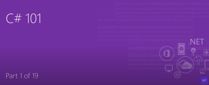
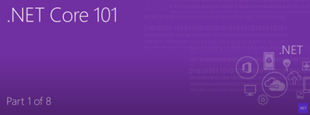
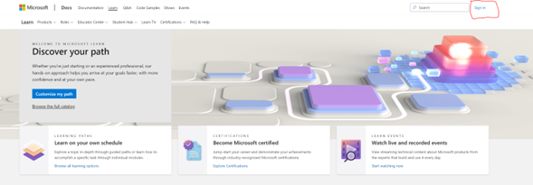
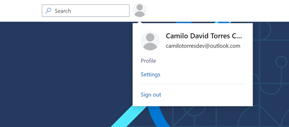

# .NET Training Fundamentals

## Introduction

If you are new in the C# world and want to start learning the bases of the language it is the start point for you to enroll in this amazing world.
As part of your beginning path, it is important to know what C# means. This video will explain to you in a summarized way what It means.

[**What is C#?**](https://www.youtube.com/watch?v=BM4CHBmAPh4)

If you want to get more information about C# you can refer to this **[C# tour](https://docs.microsoft.com/en-us/dotnet/csharp/tour-of-csharp/)**

Once you see the video, the next step would be to know about **.NET**

[**What is .NET?**](https://www.youtube.com/watch?v=eIHKZfgddLM)

For more information visit this **[link](https://dotnet.microsoft.com/en-us/learn/dotnet/what-is-dotnet)**

## **Warming up**

Now, it is time to warming up. So, as you have a Perficient account available which you can use under the Microsoft domain, it will help you to start working and coding by using the Microsoft paths.
First thing you have to do is just visit to the following page.

**[Microsoft Learn](https://docs.microsoft.com/en-us/learn/)**

It is important that once you are there just Sign In by using your Perficient account.

Once you login it should looks like this

And here we go, you are ready to start learning and training!

### Content

[C# 101](csharp101.md)

[Build .NET apps](buildotnetapps.md)