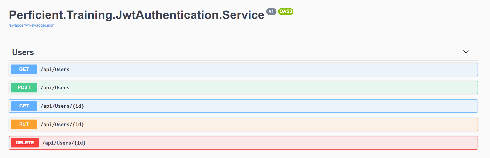

## Excercise

In this folder, you will find a solution with a configured application with the code base of a web API service that manages the user lifecycle operations.



The web app emulates a user service that contains seed users. A user is defined in the following way

```c#
public class User
{
    public Guid Id { get; set; } = Guid.NewGuid();
    public string Name { get; set; }
    public string Email { get; set; }
    public string Password { get; set; }
    public DateTime CreatedAt { get; set; }
    public UserRole Role { get; set; }
    public bool IsActiveRole { get; set; } = true;
}
```

### Requirement
The requirement is to make the endpoints protected by using an authentication schema by using JWT Tokens.
In order to make the web API secure you will need to create a new endpoint to log in, the response of this endpoint is a JWT token that will contain the user claims information.

The token should contain in the claims the following information.
- Name
- Email
- User role
- IsActiveRole flag

Once the token is generated it would be required to protect the user endpoints, which means that in order to reach those endpoints you will need to provide it as part of the request the token.

### Requirement
Once you have the endpoints protected it will be needed to make them protected based on the user role. As part of a requirement here is that the endpoints might be accessed based on the role of the user that is trying to hit it.
Once you have the endpoints protected it will be needed to make them protected based on the user role. As part of a requirement here is that the endpoints might be accessed based on the role of the user that is trying to hit it.

The defined roles are described in the following enumeration.

```c#
public enum UserRole
{
    Reader,
    Contributor,
    Manager
}
```

The rules are defined in the following way.

- Reader: Can list users and get users by id.
- Contributor: Same reader permissions also can create and update users.
- Manager: Same contributor permissions plus can delete users.

### Related Material
- [JWT Authentication in ASP.NET Core Web API](https://code-maze.com/authentication-aspnetcore-jwt-1/)
- [Role based JWT Tokens in ASP.NET Core APIs](https://weblog.west-wind.com/posts/2021/Mar/09/Role-based-JWT-Tokens-in-ASPNET-Core)
- [JWT in ASP.NET Core](https://www.c-sharpcorner.com/article/jwt-json-web-token-authentication-in-asp-net-core/)